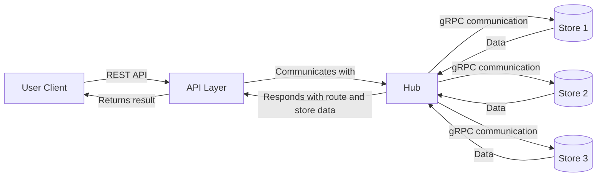

# Grocery Optimizer - Store

## Overview
The **Store Service** is responsible for providing stock status and pricing information to the system. It enables the **Hub Service** to retrieve and aggregate data from multiple store instances via **gRPC communication**. Each store instance (Store 1, Store 2, Store 3, etc.) runs as an independent service, capable of handling requests and providing up-to-date information about its inventory and pricing.

---

## Architecture
The Store Service is a key component in the grocery shopping system. It interacts with the **Hub Service** using gRPC, providing stock availability and pricing information in real-time. The system consists of the following components:

1. **User Client (UI)**: The frontend interface where users input their shopping list.
2. **API Layer**: Handles REST API requests from the client and communicates with the Hub Service.
3. **Client Service**: Aggregates stock information and optimizes the shopping route.
4. **Store Services (Store 1, Store 2, Store 3, etc.)**: Provides stock status and pricing via gRPC.

---

## Workflow

### Sequence of Operations
1. The **User** enters a shopping list in the **User Client (UI)**.
2. The **UI** sends the shopping list to the **API Layer** via a REST API request.
3. The **API Layer** forwards the request to the **Hub Service**.
4. The **Hub Service** queries multiple **Store Services** (Store 1, Store 2, Store 3, etc.) via **gRPC** to retrieve stock availability and pricing.
5. Each **Store Service** responds with stock data.
6. The **Client Service** aggregates the responses and determines an optimized shopping route.
7. The **User Client (UI)** displays the results to the **User**.

### Component Communication

---

## Technical details
- **Protocol**: gRPC, used for communication between the Hub Service and Store Services.
- **Data Format**: Protocol Buffers (protobuf)
- **Service Definition**: Includes methods for querying stock status and prices for given product lists.
- **Microservices Architecture**: Ensures modularity and scalability.

---

## Deployment
Each **Store Service** instance runs as an independent microservice and is containerized using **Docker**.
Each instance is deployed independently, typically corresponding to a physical store location. This approach allows for:

- Independent scaling of resources for each store based on demand.
- Isolated updates and maintenance without affecting other stores.
- Resilience, as issues with one store instance do not impact others.

---

## Future Improvements (v2)
Potential areas for future development of the Store Service include:

1. Implementation of caching mechanisms to reduce database load.
2. Addition of real-time inventory updates for even more accurate stock information.
3. Integration with store-specific promotion systems for personalized pricing.

---
